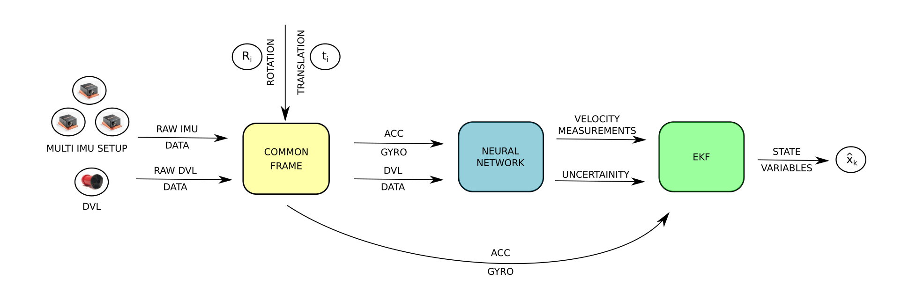

# DMIAN: Deep Multi-IMU Aided Navigation

This repository contains code and figures for the DMIAN model, submitted to Control Engineering Practice. 

## Overview

DMIAN is a deep learning framework for marine robot navigation that fuses multiple IMU sensors with DVL velocity measurements using an ensemble LSTM network. The predicted velocities and their covariances can be further fused in an estimation filter to produce position and velocity estimates.




---
## Repository Structure
- **dmian-dataset** -> *optional, external*
- **dmian**
  - **config**              -> *configuration files*
  - **src**
    - **networks** -> *model, training and testing*
    - **dataset_processor** -> *data loading and preprocessing*
    - main_script.py -> *train + test entry point*
    - auto_config_generator.py -> *auto-generate config files*

  - **models** -> *saved checkpoints*
  - **results** -> *csv outputs and plots*
  - environment.yaml
## Quick Start

### 1. Installation

Clone this repository:

```bash
git clone git@github.com:labust/dmian.git
```

Download the data from [dmian-dataset](https://huggingface.co/datasets/matkodu/dmian-dataset):

```bash
git clone git@hf.co:datasets/matkodu/dmian-dataset
```

Setup the environment:
```bash
cd dmian
conda env create -f environment.yaml
conda activate dmian
```

### 2. Training

Train the model and automatically run testing after:
```bash
python src/main_script.py \
    --config ./config/config.yaml \
    --test-dirs path/to/dmian-dataset/test/trajectory_01 \
    --results-dir ./results/
```

### 3. Testing

To skip training and run testing only:
```bash
python src/main_script.py \
    --config ./config/config.yaml \
    --model-dir ./models \
    --test-dirs path/to/dmian-dataset/test/trajectory_01 \
    --results-dir ./results/ \
    --skip-training
```

**Optional arguments** 

You can pass multiple test trajectories:
```bash
--test-dirs path/to/traj_01 path/to/traj_02 path/to/traj_03
```

Results are saved under `../results/<trajectory_name>/`.

### 4. Auto-generate Config

Generate a configuration file from your data splits (before training):

```bash
python auto_config_generator.py \
    --data-root path/to/dmian-dataset \
    --train-dirs train/trajectory_06 train/trajectory_07 train/trajectory_08 \
    --val-dirs val/trajectory_12 val/trajectory_13 \
    --test-dirs test/trajectory_01 test/trajectory_02 test/trajectory_03 \
    --output ../config/config.yaml
```

This computes normalization statistics from the training trajectories and writes them into the config file.

---

## Citation

If you use this work, please cite:

```bibtex
@article{batos2026dmian,
  title   = {DMIAN: Deep Learning-Based Multi-IMU Fusion for Enhanced Marine Aided Navigation},
  author  = {Bato\v{s}, Matko and Na\dj{}, \DJ{}ula},
  journal = {Submitted to Control Engineering Practice},
  year = {2026},
  volume = {},
  pages = {},
  issn = {},
  doi = {},
  url = {}
}
```
Citation details will be updated upon article publication.


---

## License

This project is licensed under the Apache License 2.0. See [LICENSE](LICENSE) for details.

---

### Contact

For questions or collaborations, contact:
[Matko Batoš](mailto:matko.batos@fer.unizg.hr)